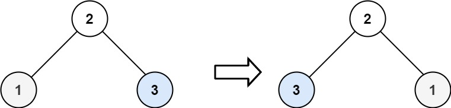

# [226. Invert Binary Tree](https://leetcode.com/problems/invert-binary-tree/)

## 題目
Given the root of a binary tree, invert the tree, and return its root.


Example 1:


Input: root = [4,2,7,1,3,6,9]
Output: [4,7,2,9,6,3,1]

Example 2:


Input: root = [2,1,3]
Output: [2,3,1]
Example 3:

Input: root = []
Output: []
 

Constraints:

* The number of nodes in the tree is in the range [0, 100].
* -100 <= Node.val <= 100

## 題目大意
反轉二叉樹

## 解題思路
用遞歸來解決，先遞歸調用反轉根節點的左children，然後遞歸調用反轉根節點的右children，然後左右交換根節點的左children和右children。

## 來源
* https://leetcode.com/problems/invert-binary-tree/

## 解答
https://github.com/kimi0230/LeetcodeGolang/blob/master/Leetcode/0226.Invert-Binary-Tree/main.go

```go
package invertbinarytree

import (
	"LeetcodeGolang/Utility/structures"
)

/**
 * Definition for a binary tree node.
 * type TreeNode struct {
 *     Val int
 *     Left *TreeNode
 *     Right *TreeNode
 * }
 */

// type TreeNode struct {
// 	Val   int
// 	Left  *TreeNode
// 	Right *TreeNode
// }

func InvertTree(root *structures.TreeNode) *structures.TreeNode {
	if root == nil {
		return nil
	}

	InvertTree(root.Left)
	InvertTree(root.Right)

	root.Left, root.Right = root.Right, root.Left
	return root
}

func InvertTree2(root *structures.TreeNode) *structures.TreeNode {

	if root != nil {
		root.Left, root.Right = InvertTree2(root.Right), InvertTree2(root.Left)
	}

	return root
}

func InvertTree3(root *structures.TreeNode) *structures.TreeNode {
	queue := make([]*structures.TreeNode, 0)
	queue = append(queue, root)

	for len(queue) > 0 {
		current := queue[0]
		queue = queue[1:]

		current.Left, current.Right = current.Right, current.Left

		if current.Left != nil {
			queue = append(queue, current.Left)
		}

		if current.Right != nil {
			queue = append(queue, current.Right)
		}
	}
	return root
}

```

```go
func BuildTree(nums []int, index int) *TreeNode {
	if index >= len(nums) || nums[index] == -1 {
		return nil
	}
	root := &TreeNode{Val: nums[index]}
	root.Left = BuildTree(nums, 2*index+1)
	root.Right = BuildTree(nums, 2*index+2)
	return root
}

func IntsToTree(nums []int) *TreeNode {
	return BuildTree(nums, 0)
}
```


##  Benchmark

```sh
goos: darwin
goarch: amd64
pkg: LeetcodeGolang/Leetcode/0226.Invert-Binary-Tree
cpu: Intel(R) Core(TM) i5-8259U CPU @ 2.30GHz
BenchmarkInvertTree-8            2533011               398.7 ns/op           168 B/op          7 allocs/op
BenchmarkInvertTree2-8           2667645               392.4 ns/op           168 B/op          7 allocs/op
BenchmarkInvertTree3-8           1403001               727.5 ns/op           296 B/op         13 allocs/op
PASS
ok      LeetcodeGolang/Leetcode/0226.Invert-Binary-Tree 4.889s
```