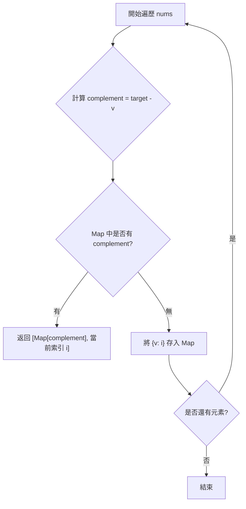
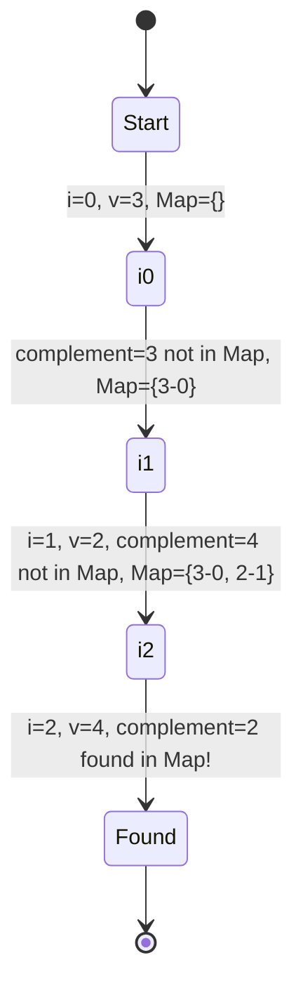

# UMPIRE 0001.Two Sum

## Output 1: UMPIRE 解題（完整思考版）

### U – Understand（理解題目）
- **題目描述**：在一個整數陣列 `nums` 中，找出兩個數字，其總和等於給定的目標值 `target`。返回這兩個數字的陣列索引。
- **關鍵限制**：
    - 每種輸入正好只有一個解。
    - 同一個元素不能使用兩次（索引不能重複）。
    - 答案順序不限。
- **Happy Path**：
    - `nums = [2, 7, 11, 15], target = 9` -> 返回 `[0, 1]` ($2 + 7 = 9$)。
- **Edge Cases**：
    - 補數在當前數字之後：`nums = [3, 2, 4], target = 6` -> 返回 `[1, 2]` ($2 + 4 = 6$)。
    - 陣列包含負數：`nums = [-1, -2, -3, -4, -5], target = -8` -> 返回 `[2, 4]` ($-3 + -5 = -8$)。

### M – Match（匹配知識）
- **主要模式**：**Hash Map (雜湊表)**。
- **為什麼適合**：
    - 為了將搜尋時間從 $O(n)$ 降到 $O(1)$，我們可以使用 Hash Map 存儲已經遍歷過的數字及其對應的索引。這使得我們對於每個數字 `x`，都能在常數時間內判斷 `target - x` 是否已經出現過。
- **其他方案**：
    - **暴力解 (Brute Force)**：使用雙層迴圈檢查所有可能的配對。時間複雜度為 $O(n^2)$，在資料量大時效率極低。
    - **排序 + 雙指針**：先對陣列排序，然後使用左右指針逼近目標值。時間複雜度為 $O(n \log n)$。雖然空間複雜度優於 Hash Map，但排序會改變索引位置，需要額外處理。

### P – Plan（制定計畫）
1. 建立一個空的 Map `m`，其中鍵 (key) 為數字的值，值 (value) 為數字在陣列中的索引。
2. 遍歷陣列 `nums` 中的每一個元素 `v` 與其索引 `i`：
    - 計算所需的補數 `complement = target - v`。
    - 檢查 `complement` 是否已經存在於 `m` 中。
    - 如果**存在**：表示我們找到了那一對數字，返回 `[m[complement], i]`。
    - 如果**不存在**：將當前數字 `v` 與索引 `i` 存入 `m` 中，以便後續元素查找。
3. 如果遍歷完整個陣列仍未找到（根據題目假設這不會發生），則返回預設值。

**Mermaid Diagram**:


### I – Implement（實際實作，Golang）
```go
func twoSum(nums []int, target int) []int {
	// 初始化 map，用於存儲：數值 -> 索引
	m := make(map[int]int)

	for i, v := range nums {
		complement := target - v
		// 檢查補數是否已在之前遍歷的元素中
		if idx, ok := m[complement]; ok {
			return []int{idx, i}
		}
		// 若沒找到，將當前元素存入 map
		m[v] = i
	}

	return []int{}
}
```

### R – Review（檢查與回顧）
- **Dry Run**：`nums = [3, 2, 4], target = 6`
    1. `i = 0, v = 3`：`complement = 3`。Map 為空。存入 `{3: 0}`。
    2. `i = 1, v = 2`：`complement = 4`。Map 只有 `{3: 0}`。存入 `{3: 0, 2: 1}`。
    3. `i = 2, v = 4`：`complement = 2`。Map 存在 `2`，索引為 `1`。
    4. 返回 `[1, 2]`。正確。
**Visual Aid**:


### E – Evaluate（總結與評估）
- **時間複雜度**：$O(n)$。我們只需對陣列進行一次線性掃描，Map 的插入與查找均為 $O(1)$。
- **空間複雜度**：$O(n)$。最壞情況下需要存儲 $n$ 個元素到 Map 中。
- **權衡**：我們使用了額外的空間（Hash Map）來換取時間複雜度的大幅提升（從 $O(n^2)$ 優化到 $O(n)$）。

---

## Output 2: 面試官口語回答腳本（精簡可直接說）

### 1️⃣ 開場：題目理解
這是一道尋找配對的經典問題。題目要求我們在陣列中找到兩個數，其和等於目標值。核心限制是每個數字只能用一次，且保證一定有一個解。

### 2️⃣ 解法選擇說明
我選擇使用 **Hash Map** 來解這題，而不是暴力解。因為暴力解的雙層迴圈會導致 $O(n^2)$ 的時間複雜度，而透過 Hash Map，我們可以將搜尋「補數」的時間降到常數級別，整體效率提高到 $O(n)$。

### 3️⃣ 解題策略概覽
我會遍歷陣列一次。在遍歷到每個數字時，我會先去 Map 裡找看看「還差多少才到目標」。如果有找到，就代表這對數字齊了；如果沒找到，我就把當前的數字和索引記錄下來，讓後面的數字來匹配。

### 4️⃣ 寫程式時會補充的關鍵說明
在實作上，順序很重要：我們要「先檢查、後存入」。這樣可以自然地避免「同一個元素被使用兩次」的問題，因為 Map 裡存的永遠是「當前索引之前」的數字。另外，在 Go 語言中，我會利用 `ok` idiom 來檢查 Map 裡是否存在補數。

### 5️⃣ 快速 Dry Run 說明
以 `target = 6`, 陣列 `[3, 2, 4]` 為例。
遇到 `3` 的時候，補數是 `3`，Map 還是空的，存入 `{3: 0}`；
遇到 `2` 的時候，補數是 `4`，沒找到，存入 `{2: 1}`；
最後看到 `4` 的時候，補數是 `2`，這時在 Map 裡找到了索引 `1`，於是成功回傳 `[1, 2]`。

### 6️⃣ 收尾總結
這個解法的**時間複雜度是 $O(n)$**，**空間複雜度也是 $O(n)$**。這是在這類配對搜尋問題中最優的時間效率。
