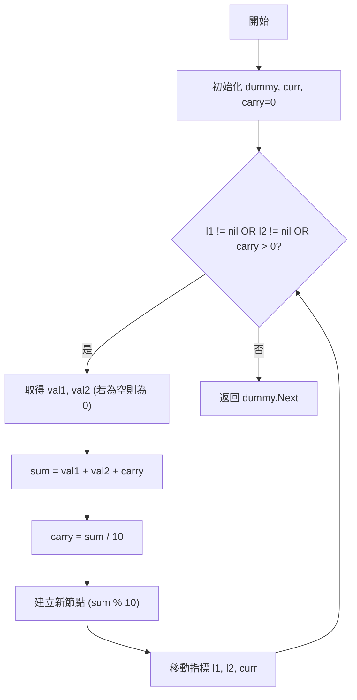
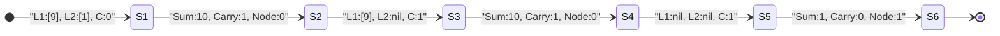

# UMPIRE 0002.Add Two Numbers

## Output 1: UMPIRE 解題（完整思考版）

### U – Understand（理解題目）
- **題目描述**：給定兩個非空的鏈結串列，表示兩個非負整數。數字以**逆序**儲存，每個節點包含一個位數。將這兩個數字相加，並以鏈結串列形式返回結果。
- **關鍵限制**：
    - 兩個數字都不會以 0 開頭，除非是數字 0 本身。
    - 數字是逆序儲存的（個位數在頭），這簡化了逐位相加的過程。
- **Happy Path**：
    - `l1 = [2, 4, 3], l2 = [5, 6, 4]` -> 返回 `[7, 0, 8]` ($342 + 465 = 807$)。
- **Edge Cases**：
    - 串列長度不同：`l1 = [0], l2 = [7, 3]` -> 返回 `[7, 3]` ($0 + 37 = 37$)。
    - 最後一位產生進位：`l1 = [9, 9], l2 = [1]` -> 返回 `[0, 0, 1]` ($99 + 1 = 100$)。

### M – Match（匹配知識）
- **主要模式**：**鏈結串列遍歷 (Linked List Traversal) + 模擬加法運算**。
- **為什麼適合**：
    - 由於數字已經是逆序排列（低位在頭），我們可以直接從頭節點開始同步遍歷兩個串列，這與我們手寫加法的過程（從個位開始加）完全一致。
- **其他方案**：
    - **轉換為整數再相加**：將鏈結串列轉為大數再相加。雖然邏輯簡單，但若鏈結串列極長，會超過語言原生整數類型的範圍，且不符合面試考察鏈結串列操作的目的。

### P – Plan（制定計畫）
1. 初始化一個 `dummy` 節點作為結果串列的起點，並建立一個 `curr` 指針指向當前位置。
2. 初始化 `carry` (進位) 為 0。
3. 開始迴圈遍歷，只要 `l1 != nil` 或 `l2 != nil` 或 `carry != 0` 就持續進行：
    - 取得 `l1` 的值（若為 `nil` 則為 0），取得 `l2` 的值（若為 `nil` 則為 0）。
    - 計算 `sum = val1 + val2 + carry`。
    - 更新 `carry = sum / 10`。
    - 建立一個值為 `sum % 10` 的新節點，接到 `curr.Next` 後，並移動 `curr`。
    - 同步移動 `l1` 與 `l2` 到下一個節點。
4. 返回 `dummy.Next`。

**Mermaid Diagram**:


### I – Implement（實際實作，Golang）
```go
func addTwoNumbers(l1 *ListNode, l2 *ListNode) *ListNode {
    dummy := &ListNode{}
    curr := dummy
    carry := 0
    
    // 只要還有數字或還有進位，就繼續計算
    for l1 != nil || l2 != nil || carry != 0 {
        val1, val2 := 0, 0
        if l1 != nil {
            val1 = l1.Val
            l1 = l1.Next
        }
        if l2 != nil {
            val2 = l2.Val
            l2 = l2.Next
        }
        
        sum := val1 + val2 + carry
        carry = sum / 10
        curr.Next = &ListNode{Val: sum % 10}
        curr = curr.Next
    }
    
    return dummy.Next
}
```

### R – Review（檢查與回顧）
- **Dry Run**：`l1 = [9, 9], l2 = [1]`
    1. `val1=9, val2=1, carry=0` -> `sum=10, carry=1, node=0`。
    2. `val1=9, val2=0, carry=1` -> `sum=10, carry=1, node=0`。
    3. `val1=0, val2=0, carry=1` (Loop 條件成立) -> `sum=1, carry=0, node=1`。
    4. 結果為 `[0, 0, 1]`。

**Visual Aid**:


### E – Evaluate（總結與評估）
- **時間複雜度**：$O(\max(m, n))$。其中 $m, n$ 分別是兩個鏈結串列的長度，我們只需遍歷一次。
- **空間複雜度**：$O(1)$。如果不計入存儲結果所需的節點空間（或計入則為 $O(\max(m, n) + 1)$）。
- **權衡**：使用 `dummy node` 大大簡化了串列初始化的判斷邏輯。

---

## Output 2: 面試官口語回答腳本（精簡可直接說）

### 1️⃣ 開場：題目理解
這題要求我們模擬兩個大數相加。題目給的是兩個鏈結串列，每個節點代表一位數，並且是逆序排列的。我們需要回傳一個同樣格式的相加結果串列。

### 2️⃣ 解法選擇說明
我會使用**直接模擬加法運算**的方式，從鏈結串列的頭部（也就是個位數）開始遍歷。這是一個典型的雙指針同步遍歷問題，核心在於對進位 `carry` 的處理。

### 3️⃣ 解題策略概覽
我會同步移動兩個串列的指針。在每一步，我把兩個節點的值加上前一步留下的進位。相加後的個位數就是新節點的值，而十位數則成為下一輪的進位。有一個細節要注意，如果兩個串列都走完了，但最後還剩下進位，一定要補上最後一個節點。

### 4️⃣ 寫程式時會補充的關鍵說明
在實作時，我會使用一個 **dummy node (虛擬頭節點)**，這樣我就不用在第一輪特別去判斷回傳串列是否為空，程式碼會簡潔很多。另外，我會把 `carry != 0` 放入 `for` 迴圈的判斷條件中，這樣可以統一處理最後一位產生的進位情況。

### 5️⃣ 快速 Dry Run 說明
以 $99 + 1$ 為例：
第一位 $9+1=10$，寫下 $0$ 進位 $1$；
第二位 $9+0$ 加上進位 $1$ 又得到 $10$，寫下 $0$ 進位 $1$；
最後兩邊都沒數字了，但進位還有 $1$，所以我再補一個節點寫下 $1$。
最後回傳的鏈結串列就是 `[0, 0, 1]`，代表 $100$。

### 6️⃣ 收尾總結
這個解法的**時間複雜度是 $O(\max(m, n))$**，我們只遍歷了最長的那個串列一次。這在效率上已經是最優解了。
