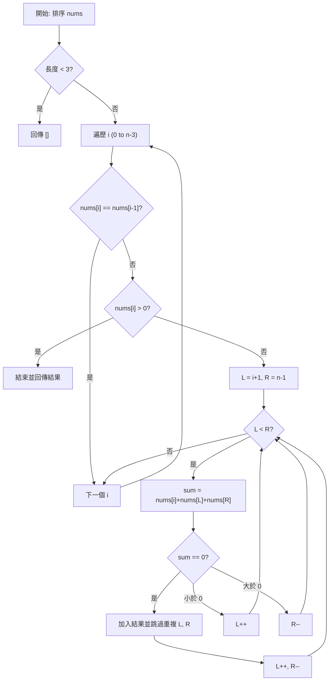

# UMPIRE 0015.3Sum

## Output 1: UMPIRE 解題（完整思考版）

### U – Understand（理解題目）
- **題目描述**：在一個整數陣列 `nums` 中，找出所有和為 0 的不重複三元組 `[a, b, c]`。
- **關鍵限制**：
    - 結果中不能包含重複的三元組。
    - 同一個位置的元素不能在一個三元組中重複使用，但陣列中若有相同數值的不同元素則可分別使用。
- **澄清**：
    - 順序不重要：`[1, 0, -1]` 與 `[-1, 0, 1]` 被視為同一個解。
- **Happy Path**：
    - `nums = [-1, 0, 1, 2, -1, -4]` -> `[[-1, -1, 2], [-1, 0, 1]]`。
- **Edge Cases**：
    - 陣列長度小於 3：`nums = [0, 1]` -> `[]`。
    - 全部都是 0：`nums = [0, 0, 0, 0]` -> `[[0, 0, 0]]` (只能有一個)。
    - 沒有解：`nums = [1, 2, 3]` -> `[]`。

### M – Match（匹配知識）
- **主要模式**：**排序 (Sorting) + 雙指針 (Two Pointers)**。
- **為什麼適合**：
    - 暴力解需要 $O(n^3)$，太慢。
    - 透過排序，我們可以固定一個數 `a`，然後將問題轉化為在剩下的陣列中尋找 `b + c = -a`。這是一個變形的 Two Sum 問題。
    - 在已排序的陣列中，我們可以使用左右雙指針向中間逼近，效率為 $O(n^2)$。
- **其他方案**：
    - **Hash Map**：雖然也能做，但去重邏輯會變得非常複雜且耗空間。排序後的雙指針法在空間和去重邏輯上更優。

### P – Plan（制定計畫）

#### Pseudo-code
```text
1. Sort nums in ascending order.
2. If len(nums) < 3, return empty result.
3. Iterate through nums with index i from 0 to len-3:
    - If nums[i] > 0, break (since sum can't be 0 for positive sorted numbers).
    - If i > 0 and nums[i] == nums[i-1], continue (skip duplicate i to avoid duplicate triplets).
    - Set L = i + 1, R = len - 1.
    - While L < R:
        - sum = nums[i] + nums[L] + nums[R]
        - If sum == 0:
            - Add [nums[i], nums[L], nums[R]] to result.
            - While L < R and nums[L] == nums[L+1], L++ (skip duplicate L).
            - While L < R and nums[R] == nums[R-1], R-- (skip duplicate R).
            - L++, R--.
        - Else if sum < 0:
            - L++.
        - Else:
            - R--.
4. Return result.
```

#### Mermaid Diagram


- **狀態改變**：`i` 固定一個數，`L` 與 `R` 縮小範圍尋找互補對。
- **避免的 Bug**：
    - 排序後如果 `nums[i] > 0` 直接停止，因為後面的數都比它大，不可能和為 0。
    - 必須在 `i`, `L`, `R` 三個地方都做去重判斷，才能保證結果唯一。

### I – Implement（實際實作，Golang）
```go
func threeSum(nums []int) [][]int {
    sort.Ints(nums)
    n := len(nums)
    res := [][]int{}
    
    for i := 0; i < n-2; i++ {
        // 如果當前數已經大於 0，後面不可能再湊出 0
        if nums[i] > 0 {
            break
        }
        // 跳過重複的固定值 i
        if i > 0 && nums[i] == nums[i-1] {
            continue
        }
        
        l, r := i+1, n-1
        for l < r {
            sum := nums[i] + nums[l] + nums[r]
            if sum == 0 {
                res = append(res, []int{nums[i], nums[l], nums[r]})
                // 去重 L
                for l < r && nums[l] == nums[l+1] {
                    l++
                }
                // 去重 R
                for l < r && nums[r] == nums[r-1] {
                    r--
                }
                l++
                r--
            } else if sum < 0 {
                l++
            } else {
                r--
            }
        }
    }
    return res
}
```

### R – Review（檢查與回顧）
- **Dry Run**：`nums = [-1, 0, 1, 2, -1, -4]`
    1. 排序後：`[-4, -1, -1, 0, 1, 2]`
    2. `i=0, v=-4`：`L=-1, R=2`, `sum=-3 < 0`, `L++`... 沒找到。
    3. `i=1, v=-1`：`L=-1, R=2`, `sum=0`。紀錄 `[-1, -1, 2]`，`L++, R--`。
    4. `i=1` 繼續：`L=0, R=1`, `sum=0`。紀錄 `[-1, 0, 1]`，`L++, R--`。
    5. `i=2, v=-1`：`nums[2] == nums[1]`，跳過。
    6. 最後得到 `[[-1, -1, 2], [-1, 0, 1]]`。

### E – Evaluate（總結與評估）
- **時間複雜度**：$O(n^2)$。排序是 $O(n \log n)$，外層迴圈 $n$ 次，內層雙指針掃描 $n$ 次，總計 $O(n^2)$。
- **空間複雜度**：$O(\log n)$ 或 $O(n)$。取決於 Go 語言內建排序演算法的空間消耗，我們沒有使用額外的大型資料結構。
- **權衡**：排序是關鍵，它讓去重變得簡單且允許我們使用雙指針來優化查找速度。

---

## Output 2: 面試官口語回答腳本（精簡可直接說）

### 1️⃣ 開場：題目理解
這題是要在一個陣列中找到所有「三個數字加起來等於 0」的組合，而且回傳的結果不能有重複。

### 2️⃣ 解法選擇說明
我會使用「排序搭配雙指針」的策略。暴力解需要 $O(n^3)$ 太慢了，而先將陣列排序後，我們可以用 $O(n^2)$ 的時間複雜度解決。

### 3️⃣ 解題策略概覽
首先我會把陣列從小到大排序。接著我用一個迴圈去固定第一個數字，然後在剩下的右邊區間，用「左指針」和「右指針」往中間靠攏。如果三個數的和太大就移動右指針縮小，太小就移動左指針增大。

### 4️⃣ 寫程式時會補充的關鍵說明
這題最麻煩的地方在於「去重」。我有三個關鍵步驟：
1. 如果目前的固定值跟上一個一樣，我就直接跳過。
2. 找到一組解後，左右指針都要各自移動並跳過重複的數值。
3. 如果當前固定的數字已經大於 0，因為陣列是有序的，後面肯定湊不出 0，這時可以直接 break 節省時間。

### 5️⃣ 快速 Dry Run 說明
假設陣列是 `[-1, -1, 0, 1, 2]`。
我固定第一個 `-1`，左指針在第二個 `-1`，右指針在 `2`。
這時和是 0，我記下 `[-1, -1, 2]`。
接著移動左指針到 `0`，右指針到 `1`，和也是 0，記下 `[-1, 0, 1]`。
下一個固定值還是 `-1`，我會跳過它，這樣就不會產生重複的組合。

### 6️⃣ 收尾總結
這個演算法的**時間複雜度是 $O(n^2)$**，**空間複雜度主要取決於排序演算法**。這是在不使用額外大量 Hash 空間的情況下，最優且最穩定的解法。
