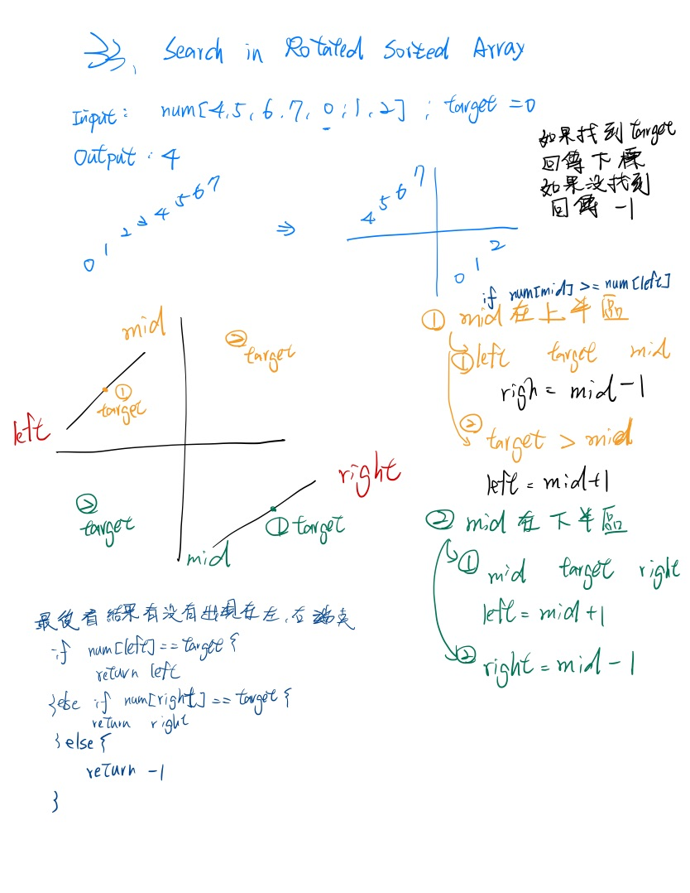

# [33. Search in Rotated Sorted Array](https://leetcode.com/problems/search-in-rotated-sorted-array/description/)

## 題目
There is an integer array nums sorted in ascending order (with distinct values).

Prior to being passed to your function, nums is possibly rotated at an unknown pivot index k (1 <= k < nums.length) such that the resulting array is [nums[k], nums[k+1], ..., nums[n-1], nums[0], nums[1], ..., nums[k-1]] (0-indexed). For example, [0,1,2,4,5,6,7] might be rotated at pivot index 3 and become [4,5,6,7,0,1,2].

Given the array nums after the possible rotation and an integer target, return the index of target if it is in nums, or -1 if it is not in nums.

You must write an algorithm with O(log n) runtime complexity.

 

Example 1:

Input: nums = [4,5,6,7,0,1,2], target = 0
Output: 4
Example 2:

Input: nums = [4,5,6,7,0,1,2], target = 3
Output: -1
Example 3:

Input: nums = [1], target = 0
Output: -1
 

Constraints:

1 <= nums.length <= 5000
-104 <= nums[i] <= 104
All values of nums are unique.
nums is an ascending array that is possibly rotated.
-104 <= target <= 104

## 題目大意
整個數組按照升序排序, 值不相同
在傳遞給函數之前， nums 在預先未知的某個下標 k （ 0 <= k < nums.length ）上進行了 旋轉，使數位變數 [nums[k], nums[k+1], ..., nums[n-1], nums[0], nums[1], ..., nums[k-1]] （下標 從 0 開始 計數）。 例如， [0,1,2,4,5,6,7] 在下標 3 處經旋轉後可能變為 [4,5,6,7,0,1,2] 。

給你 旋轉後 的陣列 nums 和一個整數 target ，如果 nums 中存在這個目標值 target ，則返回它的下標，否則返回 -1 。

你必須設計一個時間複雜度為 O(log n) 的演演算法解決此問題。

## 解題思路

先判斷mid位於上半部還是下半部, 再來找target位於哪邊
最後看target是否有在左或右端點




## Big O

* 時間複雜 : `O(log n)`
* 空間複雜 : `O(1)`

## 來源
* https://leetcode.com/problems/search-in-rotated-sorted-array/description/
* https://leetcode.cn/problems/

## 解答
https://github.com/kimi0230/LeetcodeGolang/blob/master/Leetcode/0033.Search-in-Rotated-Sorted-Array/main.go

```go
package searchinrotatedsortedarray

// 時間複雜 O(), 空間複雜 O()
func search(nums []int, target int) int {
	if nums == nil || len(nums) == 0 {
		return -1
	}
	left, right := 0, len(nums)-1
	for left < right {
		mid := int(uint(left+right) >> 1)

		if nums[mid] == target {
			return mid
		}

		if nums[mid] >= nums[left] {
			// mid在上半區

			if nums[left] <= target && target <= nums[mid] {
				// target 在left跟min中間
				right = mid - 1
			} else {
				left = mid + 1
			}
		} else {
			// mid在下半區
			if nums[mid] <= target && target <= nums[right] {
				// target 在min跟right中間
				left = mid + 1
			} else {
				right = mid - 1
			}
		}
	}
	if nums[left] == target {
		return left
	} else if nums[right] == target {
		return right
	} else {
		return -1
	}
}

```

##  Benchmark

```sh

```